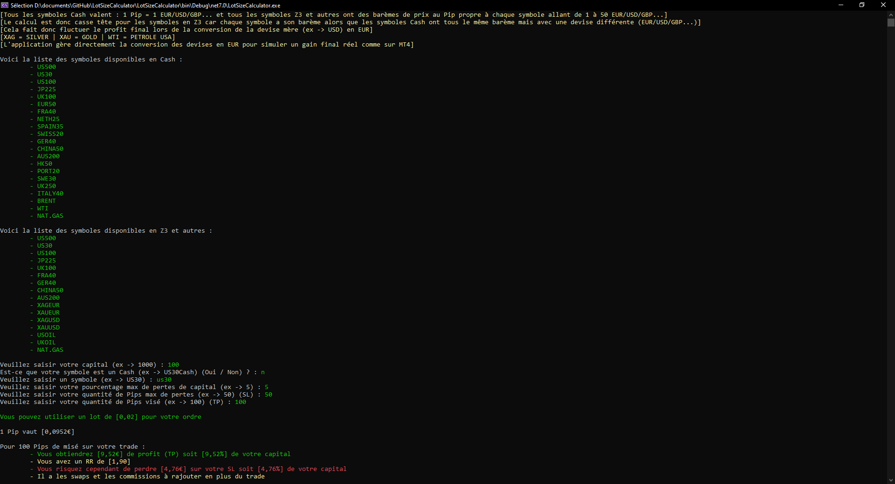

# LotSizeCalculator
## Introduction
__Problématique__ : j'ai eu beacoup de difficultés à comprendre les lots en trading car les données varies en fonction des actifs.

J'ai donc pensé à créer une application console en C# pour simplifier la vie des tradeurs débutants notamment en calculant automatiquement leur lot en fonction de leur money management.

Vous retrouverez toutes les informations dans l'executable.

Cette application est basée sur le broker IronFX et n'est donc pas valable pour les autres brokers.

